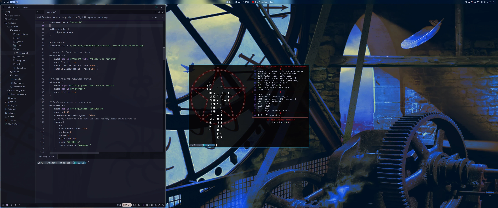

# NixOS / Niri Configuration



- Modular, reproducible NixOS Flake & Home Manager configuration (flat dendritic layout via `flake-parts` + `import-tree`)
- Declarative secret encryption and runtime provisioning via [sops-nix](https://github.com/Mic92/sops-nix) and [age](https://github.com/FiloSottile/age)
- GPU-accelerated Wayland desktop with [Niri](https://github.com/YaLTeR/niri) and [Noctalia Shell](https://github.com/noctalia-dev/noctalia)
- Headless streaming via Sunshine/Moonlight with custom EDID injection & RealtimeKit PipeWire priority
- Unified task management via [Just](https://github.com/casey/just) (`j` runner)

---

## Core Components

| Component | Software | Description |
| :--- | :--- | :--- |
| **OS** | [NixOS](https://nixos.org/) (Unstable Flake) | Declarative, reproducible system configuration with `nix-ld` FHS binary compatibility |
| **Compositor** | [Niri](https://github.com/YaLTeR/niri) | Scrollable-tiling Wayland compositor with custom active gradients & floating rules |
| **Shell & Bar** | [Noctalia](https://github.com/noctalia-dev/noctalia) | Status bar, audio visualizer, media widget, control center, weather, and launcher |
| **Terminal** | [Foot](https://codeberg.org/dnkl/foot) | Fast Wayland terminal client/server daemon with dark theme, tiling (`Mod+T`), and scratchpad (`Mod+S`) |
| **Editor** | [Neovim](https://neovim.io/) / [Zed](https://zed.dev/) | Lua-based Lazy.nvim setup + Zed editor with `basedpyright`, `ruff`, `nil`, `lua-ls`, and `nixd` |
| **Browser** | [Zen Browser](https://zen-browser.app/) | Privacy-focused Gecko browser |
| **File Manager** | [Nautilus](https://apps.gnome.org/Nautilus/) (GNOME Files) | GTK4/Adwaita file manager with Sushi QuickLook & "Open in Foot" integration |
| **Media Player** | [`spotify_player`](https://github.com/aome510/spotify-player) | Headless background daemon (`systemd.user.services.spotify-player`) with MPRIS & launcher bridge |
| **Secrets** | [sops-nix](https://github.com/Mic92/sops-nix) | Declarative secret decryption (`smb-credentials`, `ssh-hosts`) via Age keys |
| **Streaming** | [Sunshine](https://github.com/LizardByte/Sunshine) / Moonlight | Low-latency Wayland KMS capture with custom EDID injection & rtkit priority |
| **Theming** | Catppuccin Mocha + Inter 9pt | Unified dark theme across GTK, Foot, Zed, Neovim, and Starship |

---

## Repository Structure

```text
nixcfg/
├── flake.nix                         # Flake root with flake-parts & dendritic module imports
├── flake.lock                        # Pinned dependencies
├── .sops.yaml                        # SOPS encryption keys and recipient rules
├── justfile                          # Global system runner with dynamic host/user & auto-staging
├── secrets/
│   └── secrets.yaml                  # Encrypted sops secrets (smb-credentials, ssh-hosts)
├── modules/
│   ├── flake-options.nix             # Top-level flake-parts options & tree formatter
│   ├── lib.nix                       # Cross-host helpers (rage.repoPath & link out-of-store helper)
│   ├── features/
│   │   ├── core.nix                  # Systemd-boot, zram, nix-ld, nix settings, baseline services
│   │   ├── hardware.nix              # Base audio (PipeWire), Bluetooth, OpenGL graphics drivers
│   │   ├── secrets/                  # Sops-nix declarative secret decryption module
│   │   ├── desktop/                  # Workstation GUI modules
│   │   │   ├── appearance/           # GTK theme, cursor, font scaling, icon packages
│   │   │   ├── apps/                 # Graphical user packages (Zen Browser, etc.)
│   │   │   ├── foot/                 # Foot terminal config & Nautilus open-in-foot extension
│   │   │   ├── nautilus/             # Nautilus file manager, sushi preview, dconf settings
│   │   │   ├── niri/                 # Niri compositor, greetd auto-login, config.kdl
│   │   │   ├── noctalia/             # Noctalia shell, settings.toml, plugins/spotify, wallpapers
│   │   │   └── sunshine/             # Sunshine game streaming server, KMS capture, uinput
│   │   ├── development/              # Developer toolchains & IDEs
│   │   │   ├── default.nix           # Dev aggregator + antigravity-cli & python3
│   │   │   ├── ardupilot/            # ArduPilot completion hook & dev environment
│   │   │   ├── direnv/               # Direnv & nix-direnv caching
│   │   │   ├── git/                  # Git configuration & productivity aliases
│   │   │   ├── language-servers/     # LSP binaries (basedpyright, ruff, nil, nixd, etc.)
│   │   │   ├── nixcfg-tooling/       # Just runner integration, complete-j.sh, 'j' wrapper
│   │   │   ├── proxmox-remote/       # Remote Proxmox VE admin utilities (pve-update-lxcs)
│   │   │   └── zed/                  # Zed editor settings, filetype mappings, LSP configs
│   │   ├── media/                    # Media stack & storage
│   │   │   ├── makemkv/              # Optical disc ripping & video transcoding (ffmpeg, mkvtoolnix)
│   │   │   ├── media-apps/           # Media playback & streaming download utilities (vlc, yt-dlp)
│   │   │   ├── scripts/              # Custom import-movie and import-tv Python CLIs & packages
│   │   │   ├── spotify-player/       # Terminal Spotify client daemon & MPRIS bridge
│   │   │   └── storage/              # Configurable NFS/SMB automounts & XDG directory bindings
│   │   └── shell/                    # Interactive terminal environment
│   │       ├── bash/                 # Bash shell configuration & initExtra.sh hooks
│   │       ├── bat/                  # Syntax-highlighting cat clone (bat) & 'cat' alias
│   │       ├── btop/                 # System resource monitor with custom themes
│   │       ├── fastfetch/            # System fetch tool with Starman art & Pkgs snapshot age
│   │       ├── nvim/                 # Neovim configuration (Lazy, Basedpyright, Ruff, Snacks)
│   │       ├── ssh/                  # Declarative SSH client with sops host inventory
│   │       └── starship/             # Cross-shell prompt configuration
│   └── hosts/
│       └── rage-nix/                 # Host composition for rage-nix
│           ├── default.nix           # Flake output instances (nixosConfigurations, homeConfigurations)
│           ├── configuration.nix     # User accounts, storage mounts, secrets, and module imports
│           └── hardware.nix          # Hardware drivers, kernel modules, QEMU agent, filesystems
└── README.md                         # Architecture documentation
```

---

## System Management (`just` / `j`)

All system operations are unified under **`just`** with a global alias **`j`** and full Bash tab autocompletion:

| Command | Shorthand | Description |
| :--- | :--- | :--- |
| `just switch` | `j switch` | Build and activate both Home Manager and NixOS system configurations |
| `just switch-host` | `j switch-host` | Rebuild and activate NixOS system only (`sudo nixos-rebuild switch`) |
| `just switch-home` | `j switch-home` | Rebuild and activate Home Manager only (`home-manager switch`) |
| `just diff` | `j diff` | Show package & closure differences against current system and home |
| `just fmt` | `j fmt` | Format all Nix files using official `nixfmt-tree` standard |
| `just history` | `j history` | List active and past NixOS system and Home Manager generations |
| `just build` | `j build` | Dry-build both configurations to verify syntax without activating |
| `just check` | `j check` | Run `nix flake check` validation |
| `just update` | `j update` | Update all flake inputs (or specific input: `j update zen-browser`) |
| `just update-switch` | `j update-switch` | Update inputs and immediately switch system and home in one command |
| `just gc [scope]` | `j gc` / `j gc all` | Collect garbage (keeps 7d by default; pass `all` to purge all past generations) |
| `just optimise` | `j optimise` | Deduplicate Nix store hardlinks (`nix store optimise`) |
| `just search <pkg>` | `j search niri` | Search packages on search.nixos.org in browser |
| `just search-options <opt>` | `j search-options niri` | Search NixOS options on search.nixos.org in browser |
| `just secrets` | `j secrets` | Edit encrypted `secrets/secrets.yaml` via SOPS |
| `just ssh-copy-id <target>` | `j ssh-copy-id user@host` | Deploy Ed25519 public key to remote host |

---

## Hotkeys & Shortcuts

### Niri Window Manager
* `Mod + T`: Open standard tiling Foot terminal (`footclient`)
* `Mod + Shift + T`: Open standalone Foot terminal (`foot`)
* `Mod + S`: Open centered 900×560 floating scratchpad terminal
* `Mod + B`: Open Zen Browser
* `Mod + E`: Open Nautilus file manager
* `Mod + M`: Open floating `spotify_player` TUI window
* `Mod + P`: **Toggle Spotify Play / Pause** (`spotify_player playback play-pause`)
* `Mod + D`: Open Noctalia application launcher
* `Mod + O`: Toggle workspace overview
* `Mod + Q`: Close focused window
* `Mod + H / J / K / L` or `Arrows`: Focus navigation across columns/windows
* `Mod + Ctrl + H / J / K / L`: Move column/window position

### Noctalia Launcher Providers
* **`/spot <query>`**: Real-time search across Spotify tracks, albums, and playlists. Press `Enter` to play immediately.
* **`/playlist`**: Browse your saved library and playlists with real-time fuzzy filtering (`/playlist rush`).
* **`/radio`**: Generate instant dynamic radio based on what is currently playing, or search any artist/song (`/radio queen`).

### Nautilus (File Manager)
* `Space`: **GNOME Sushi QuickLook** preview (images, videos, audio, code, PDFs)
* `Right-Click`: **Open in Foot** terminal action
* `Ctrl + L`: Open direct editable path entry bar

---

## Media Ingest Tools

* `import-movie <file>`: Interactive Jellyfin movie importer with live progress, metadata fetching, and automatic NFS organization.
* `import-tv [options] <files...>`: TV show and season batch organizer with TVDB metadata renaming.
